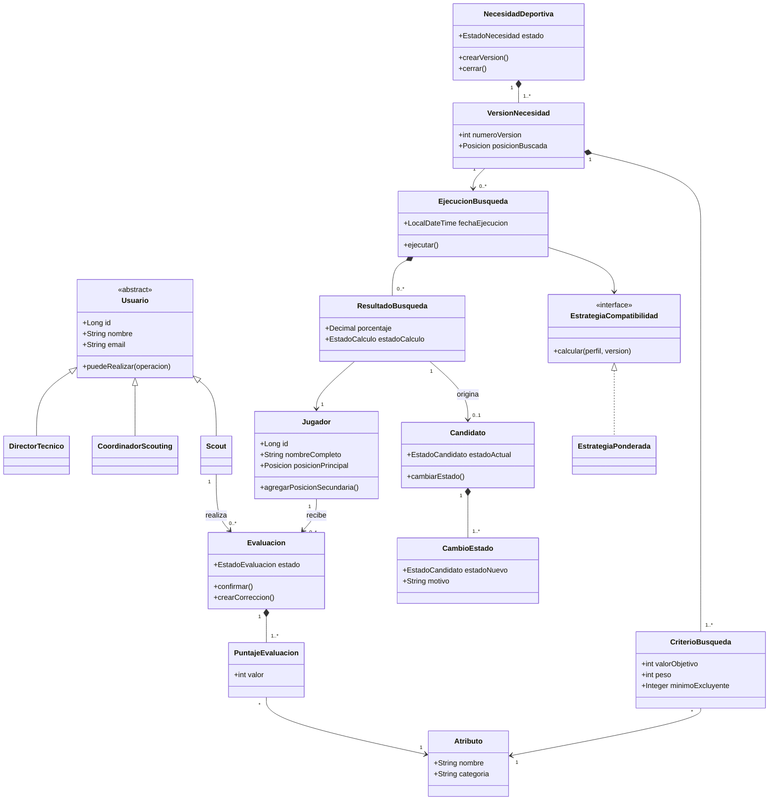
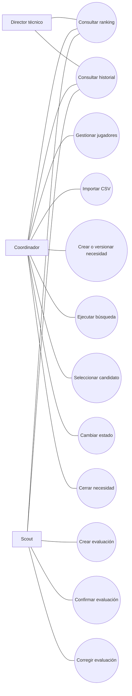
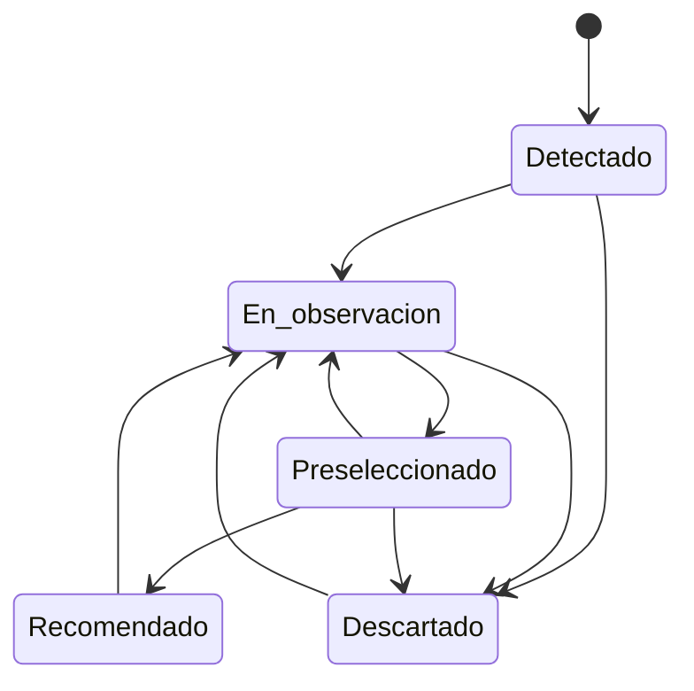

# Especificación del sistema

## Sistema de Búsqueda y Evaluación de Jugadores de Fútbol

| Campo | Valor |
|---|---|
| Versión | 1.0 |
| Estado | Alcance confirmado |
| Materia | Ingeniería de Software 2 |
| Tipo de producto | MVP web funcional |
| Modalidad de ejecución | Local, para demostración académica |

## 1. Resumen ejecutivo

El sistema permitirá que el cuerpo técnico de un club encuentre jugadores compatibles con una necesidad deportiva concreta. Por ejemplo, el director técnico podrá solicitar un mediocampista central con buen pase que juegue en la liga argentina.

El director técnico comunicará la necesidad al coordinador de scouting, quien la registrará mediante filtros, valores objetivo, mínimos excluyentes y pesos de importancia. El sistema consultará una base de jugadores, construirá sus perfiles a partir de evaluaciones realizadas por scouts y devolverá una lista ordenada y explicable de resultados.

El ranking será una herramienta de apoyo. El sistema no decidirá contrataciones ni reemplazará el criterio humano. El coordinador elegirá cuáles resultados se incorporan formalmente al seguimiento como candidatos.

## 2. Problema

En un proceso de scouting, la información puede encontrarse dispersa en planillas, informes y apreciaciones individuales. Esto genera los siguientes problemas:

- Dificultad para encontrar jugadores que respondan a una necesidad concreta.
- Criterios de evaluación poco uniformes entre scouts.
- Falta de trazabilidad sobre el origen y la fecha de las valoraciones.
- Dificultad para conocer cuánta evidencia respalda una recomendación.
- Duplicación de jugadores e informes.
- Pérdida del historial de observaciones y decisiones.

El sistema centralizará la información, normalizará las evaluaciones y aplicará un mecanismo de compatibilidad reproducible y comprensible.

## 3. Objetivos

### 3.1 Objetivo general

Diseñar e implementar un MVP web que permita registrar jugadores, evaluarlos, definir necesidades deportivas, obtener resultados ordenados por compatibilidad y administrar el seguimiento de los candidatos seleccionados.

### 3.2 Objetivos específicos

- Centralizar los datos básicos de los jugadores.
- Estandarizar los atributos utilizados por los scouts.
- Conservar el contexto y la autoría de cada evaluación.
- Construir un perfil agregado sin favorecer al scout que haya realizado más informes.
- Permitir búsquedas mediante filtros y criterios ponderados.
- Explicar cómo se obtuvo cada porcentaje de compatibilidad.
- Diferenciar un resultado de búsqueda de un candidato en seguimiento.
- Mantener el historial de evaluaciones, búsquedas y cambios de estado.

## 4. Alcance del MVP

El MVP incluirá:

1. Registro e inicio de sesión.
2. Selección de rol durante el registro.
3. Gestión manual de jugadores.
4. Importación de jugadores mediante CSV.
5. Catálogo fijo de atributos deportivos.
6. Registro y confirmación de evaluaciones de scouts.
7. Cálculo del perfil agregado de cada jugador.
8. Creación y versionado de necesidades deportivas.
9. Configuración de filtros y criterios ponderados.
10. Ejecución manual del algoritmo de compatibilidad.
11. Visualización explicable de todos los resultados compatibles.
12. Selección manual de candidatos para seguimiento.
13. Gestión de estados e historial de candidatos.
14. Cierre manual de necesidades deportivas.

### 4.1 Fuera del alcance

No se incluirán en esta versión:

- Machine learning entrenado con datos históricos.
- Predicción del rendimiento futuro.
- Descubrimiento autónomo de jugadores en Internet.
- Integración con APIs o plataformas externas.
- Análisis de video.
- Aplicación móvil nativa.
- Gestión de contratos, transferencias, salarios o plantel.
- Decisiones automáticas de contratación.
- Notificaciones internas o por correo.
- Paneles estadísticos avanzados.
- Exportación de informes a PDF.
- Ponderación automática por antigüedad de las evaluaciones.
- Despliegue público en Internet.
- Seguridad preparada para un entorno productivo.
- Soporte para otros deportes.

## 5. Supuestos y restricciones

- El sistema se utilizará con datos académicos o ficticios.
- Se ejecutará localmente durante la demostración.
- Se diseñará para un único club.
- Soportará hasta 10 usuarios y 10.000 jugadores.
- Los jugadores podrán cargarse manualmente o importarse desde CSV.
- Las valoraciones deportivas serán realizadas por scouts; no se inventarán automáticamente.
- Los atributos usarán valores enteros de 1 a 10.
- El registro permitirá elegir libremente el rol para facilitar la demostración local.
- La libre elección de roles es una limitación de seguridad aceptada exclusivamente para el MVP académico.
- En un producto real, los roles deberían requerir aprobación o ser asignados por un administrador.

## 6. Actores y permisos

### 6.1 Director técnico

Responsabilidades:

- Comunicar la necesidad deportiva.
- Consultar necesidades, rankings y candidatos.
- Participar en la decisión deportiva final.

Permisos:

- Acceso de solo lectura a búsquedas, resultados, candidatos e historiales.

### 6.2 Coordinador de scouting

Responsabilidades:

- Registrar y actualizar jugadores.
- Importar jugadores mediante CSV.
- Traducir la necesidad del DT a criterios de búsqueda.
- Crear versiones de una necesidad.
- Ejecutar búsquedas.
- Seleccionar resultados como candidatos.
- Administrar estados y cerrar necesidades.

### 6.3 Scout

Responsabilidades:

- Consultar jugadores.
- Crear borradores de evaluaciones.
- Confirmar evaluaciones.
- Consultar sus informes y el historial permitido.

### 6.4 Matriz de permisos

| Operación | DT | Coordinador | Scout |
|---|:---:|:---:|:---:|
| Consultar jugadores | Sí | Sí | Sí |
| Crear o editar jugadores | No | Sí | No |
| Importar CSV | No | Sí | No |
| Registrar evaluaciones | No | No | Sí |
| Crear o versionar necesidades | No | Sí | No |
| Ejecutar búsquedas | No | Sí | No |
| Consultar rankings | Sí | Sí | Sí |
| Seleccionar candidatos | No | Sí | No |
| Cambiar estados | No | Sí | No |
| Cerrar necesidades | No | Sí | No |

## 7. Flujo principal

1. Un usuario se registra, selecciona un rol e inicia sesión.
2. El coordinador registra o importa jugadores.
3. Los scouts observan jugadores y cargan evaluaciones.
4. Cada evaluación se guarda inicialmente como borrador.
5. El scout confirma la evaluación.
6. El sistema actualiza el perfil agregado del jugador.
7. El DT comunica una necesidad al coordinador.
8. El coordinador crea una necesidad y su primera versión.
9. Configura posición, filtros, valores objetivo, mínimos excluyentes y pesos.
10. El coordinador ejecuta la búsqueda.
11. El sistema filtra jugadores y calcula compatibilidades cuando existen datos suficientes.
12. El sistema muestra todos los resultados compatibles y explica cada puntaje.
13. El coordinador selecciona algunos resultados y los incorpora al seguimiento.
14. Los scouts agregan nuevas evaluaciones.
15. El coordinador vuelve a ejecutar la búsqueda cuando desea actualizar el ranking.
16. El coordinador administra los estados de los candidatos.
17. Finalmente, cierra manualmente la necesidad.

Flujo resumido:

`Cargar jugadores -> evaluar -> definir necesidad -> ejecutar búsqueda -> revisar resultados -> seleccionar candidatos -> hacer seguimiento -> cerrar necesidad`

## 8. Requisitos funcionales

### RF-01: Registrar usuario

El sistema deberá permitir registrar una cuenta con nombre, correo electrónico, contraseña y rol.

### RF-02: Autenticar usuario

El sistema deberá permitir iniciar y cerrar sesión y restringir las operaciones según el rol seleccionado.

### RF-03: Gestionar jugador

El coordinador deberá poder crear, consultar y actualizar jugadores con los siguientes datos:

- Identificador externo opcional.
- Nombre completo.
- Fecha de nacimiento.
- Nacionalidad.
- Club.
- Liga.
- Pie dominante.
- Posición principal.
- Una o más posiciones secundarias.

### RF-04: Importar jugadores desde CSV

El coordinador deberá poder seleccionar un archivo CSV, visualizar una vista previa, revisar errores y confirmar la importación.

### RF-05: Detectar posibles duplicados

El sistema deberá buscar coincidencias primero por identificador externo. Si no existe, utilizará nombre completo y fecha de nacimiento.

### RF-06: Resolver duplicados de importación

Ante una coincidencia, el sistema deberá pedir confirmación antes de actualizar el jugador existente. Nunca sobrescribirá automáticamente sus evaluaciones.

### RF-07: Crear evaluación

El scout deberá poder evaluar un jugador registrando:

- Fecha de observación.
- Rival.
- Competencia.
- Posición observada.
- Valor de cada atributo.
- Fortalezas.
- Debilidades.
- Comentario general.

### RF-08: Gestionar borrador de evaluación

El scout deberá poder guardar y editar una evaluación mientras permanezca como borrador.

### RF-09: Confirmar evaluación

Al confirmarse, la evaluación deberá quedar inmutable y participar del perfil agregado del jugador.

### RF-10: Corregir evaluación confirmada

Una corrección deberá generar una nueva versión. La versión anterior se conservará para auditoría y no participará simultáneamente del cálculo.

### RF-11: Calcular perfil agregado

El sistema deberá construir el perfil deportivo a partir de evaluaciones confirmadas. Primero calculará el promedio de cada scout y luego promediará entre scouts.

### RF-12: Crear necesidad deportiva

El coordinador deberá poder registrar una necesidad con título, descripción, posición buscada y filtros generales.

### RF-13: Crear versión de necesidad

Toda modificación de los criterios deberá crear una versión nueva sin alterar ejecuciones ni candidatos anteriores.

### RF-14: Configurar filtros generales

La necesidad podrá incluir filtros por:

- Posición.
- Liga.
- Edad mínima y máxima.
- Nacionalidad.
- Pie dominante.

### RF-15: Configurar criterio deportivo

Para cada atributo seleccionado, el coordinador deberá indicar:

- Valor objetivo entre 1 y 10.
- Peso entre 1 y 5.
- Mínimo excluyente opcional entre 1 y 10.

### RF-16: Ejecutar búsqueda

El coordinador deberá iniciar manualmente una ejecución de búsqueda asociada a una versión de necesidad.

### RF-17: Filtrar por posición

Un jugador deberá considerarse válido si la posición buscada coincide con su posición principal o con alguna secundaria. El resultado indicará el tipo de coincidencia.

### RF-18: Aplicar filtros excluyentes

El sistema deberá excluir jugadores que no cumplan los filtros generales o un mínimo deportivo marcado como excluyente.

### RF-19: Manejar datos insuficientes

Si falta una valoración necesaria para calcular un criterio, el sistema deberá mostrar al jugador como `Datos insuficientes` y no asignarle un porcentaje.

### RF-20: Manejar jugadores no evaluados

Un jugador que cumpla los filtros generales pero no posea evaluaciones deberá aparecer como `Pendiente de evaluación`, sin porcentaje.

### RF-21: Priorizar evaluaciones por posición

Para construir el perfil usado en una búsqueda, el sistema deberá priorizar las evaluaciones realizadas en la posición buscada. Si no existen, utilizará las evaluaciones disponibles y mostrará una advertencia.

### RF-22: Calcular compatibilidad

El sistema deberá calcular un porcentaje mediante la estrategia ponderada definida en la sección 15.

### RF-23: Mostrar ranking explicable

El sistema deberá mostrar todos los resultados que superen los filtros, ordenando primero los porcentajes de mayor a menor y separando los casos sin porcentaje.

Cada resultado deberá incluir:

- Porcentaje de compatibilidad, cuando pueda calcularse.
- Desglose por atributo.
- Valor objetivo, promedio obtenido y aporte al resultado.
- Coincidencia por posición principal o secundaria.
- Cantidad de scouts.
- Cantidad de evaluaciones.
- Fecha de la última observación.
- Advertencias sobre evidencia limitada o posición alternativa.

### RF-24: Conservar ejecución

Cada ejecución deberá conservar su fecha, versión de necesidad y resultados para permitir reconstruir la decisión.

### RF-25: Actualizar ranking bajo demanda

Las evaluaciones nuevas no modificarán ejecuciones anteriores. El coordinador deberá volver a ejecutar la búsqueda para obtener resultados actualizados.

### RF-26: Seleccionar candidato

El coordinador deberá elegir manualmente un resultado para incorporarlo al seguimiento. Aparecer en el ranking no convertirá automáticamente al jugador en candidato.

### RF-27: Gestionar estado

El coordinador deberá actualizar al candidato utilizando los estados:

1. `Detectado`.
2. `En observación`.
3. `Preseleccionado`.
4. `Recomendado`.
5. `Descartado`.

### RF-28: Registrar cambio de estado

Cada cambio deberá conservar estado anterior, estado nuevo, autor, fecha y motivo. El motivo será obligatorio al descartar.

### RF-29: Consultar historial

Los usuarios autorizados deberán poder consultar evaluaciones, versiones, ejecuciones y cambios de estado relacionados con un candidato.

### RF-30: Cerrar necesidad

El coordinador deberá cerrar manualmente una necesidad. El cierre no eliminará sus versiones, ejecuciones ni candidatos.

## 9. Requisitos no funcionales

### RNF-01: Usabilidad

Los flujos principales deberán utilizar formularios, etiquetas y mensajes comprensibles para usuarios no técnicos.

### RNF-02: Rendimiento

Sobre una base de hasta 10.000 jugadores, una búsqueda deberá responder en menos de tres segundos en el entorno local de demostración.

### RNF-03: Capacidad

El MVP deberá admitir hasta 10 usuarios y 10.000 jugadores.

### RNF-04: Integridad

Los valores de atributos deberán ser enteros de 1 a 10 y los pesos enteros de 1 a 5.

### RNF-05: Trazabilidad

Las evaluaciones, versiones, ejecuciones y transiciones deberán conservar autor, fecha y relación con sus antecedentes.

### RNF-06: Explicabilidad

Todo porcentaje deberá acompañarse con los datos y operaciones que lo originaron.

### RNF-07: Seguridad básica

Las contraseñas deberán almacenarse mediante hash seguro y las rutas deberán verificar el rol autenticado.

### RNF-08: Limitación de seguridad

La elección libre de rol será admisible únicamente en el MVP local. El sistema deberá mostrar esta condición en su documentación.

### RNF-09: Mantenibilidad

El algoritmo de compatibilidad deberá estar desacoplado mediante el patrón Strategy.

### RNF-10: Persistencia

Los datos deberán conservarse en una base relacional PostgreSQL.

### RNF-11: Portabilidad local

El proyecto deberá incluir instrucciones para instalar dependencias, crear la base y ejecutar la aplicación.

### RNF-12: Recuperación de errores

Una fila inválida del CSV no deberá provocar la pérdida de las filas válidas ni dejar una importación parcialmente confirmada sin registro.

## 10. Catálogo fijo de atributos

El MVP utilizará el siguiente catálogo, con valores enteros de 1 a 10:

| Categoría | Atributo | Descripción resumida |
|---|---|---|
| Técnica | Pase | Precisión y calidad de distribución |
| Técnica | Control | Recepción y dominio del balón |
| Técnica | Conducción | Traslado del balón bajo control |
| Técnica | Definición | Capacidad de finalizar jugadas |
| Táctica | Visión | Lectura de opciones y espacios |
| Táctica | Posicionamiento | Ocupación adecuada de espacios |
| Defensiva | Recuperación | Capacidad de recuperar la posesión |
| Defensiva | Marcaje | Seguimiento y control del rival |
| Física | Velocidad | Desplazamiento y aceleración |
| Física | Resistencia | Capacidad de sostener el esfuerzo |
| Física | Fuerza | Rendimiento en disputas físicas |
| Mixta | Juego aéreo | Rendimiento en acciones por elevación |

El catálogo no será administrable desde la interfaz del MVP. Agregar o modificar atributos requerirá una futura ampliación.

## 11. Historias de usuario y criterios de aceptación

### HU-01: Registrar jugador

**Como** coordinador,  
**quiero** registrar los datos de un jugador,  
**para** incorporarlo a la base de scouting.

**Criterios de aceptación:**

- Nombre, fecha de nacimiento y posición principal son obligatorios.
- Puede tener ninguna o varias posiciones secundarias.
- No se puede repetir una posición como principal y secundaria.
- El sistema advierte posibles duplicados antes de guardar.

### HU-02: Importar jugadores

**Como** coordinador,  
**quiero** importar jugadores desde un CSV,  
**para** evitar cargarlos individualmente.

**Criterios de aceptación:**

- Se muestra una vista previa antes de confirmar.
- Cada fila presenta su estado de validación.
- Las filas inválidas indican el motivo.
- Los duplicados requieren una decisión explícita.
- Las evaluaciones existentes nunca se sobrescriben.

### HU-03: Evaluar jugador

**Como** scout,  
**quiero** puntuar y describir a un jugador observado,  
**para** aportar evidencia al perfil utilizado por el sistema.

**Criterios de aceptación:**

- La evaluación conserva scout, fecha, rival, competencia y posición observada.
- Todos los puntajes se validan entre 1 y 10.
- El borrador puede editarse.
- La evaluación confirmada queda inmutable.
- Una corrección genera una nueva versión.

### HU-04: Crear necesidad deportiva

**Como** coordinador,  
**quiero** traducir el pedido del DT a filtros y criterios ponderados,  
**para** ejecutar una búsqueda reproducible.

**Criterios de aceptación:**

- Se debe seleccionar una posición.
- Cada criterio incluye objetivo, peso y mínimo excluyente opcional.
- Los pesos no necesitan sumar 100; el sistema los normaliza.
- Modificar criterios crea una nueva versión.

### HU-05: Obtener resultados compatibles

**Como** coordinador,  
**quiero** recibir todos los jugadores que cumplen los filtros, ordenados por compatibilidad,  
**para** identificar opciones para el DT.

**Criterios de aceptación:**

- Se aceptan coincidencias de posición principal o secundaria.
- Los mínimos excluyentes eliminan al jugador.
- Los casos sin evidencia aparecen sin porcentaje.
- Los resultados con porcentaje se ordenan de mayor a menor.
- Las ejecuciones previas no cambian al ingresar evaluaciones nuevas.

### HU-06: Comprender una recomendación

**Como** director técnico,  
**quiero** ver el desglose y la evidencia de cada resultado,  
**para** comprender por qué el sistema lo ubicó en esa posición.

**Criterios de aceptación:**

- Se muestran promedio, objetivo, peso y aporte por atributo.
- Se muestran cantidad de scouts y evaluaciones.
- Se muestra la fecha de la última observación.
- Una sola evaluación se identifica como evidencia preliminar.
- El uso de evaluaciones de otra posición genera una advertencia.

### HU-07: Seleccionar candidato

**Como** coordinador,  
**quiero** incorporar manualmente un resultado al seguimiento,  
**para** evitar que todos los resultados se conviertan en candidatos.

**Criterios de aceptación:**

- El candidato conserva la versión y ejecución de origen.
- Un jugador no puede duplicarse como candidato de la misma versión.
- La selección inicial asigna el estado `Detectado`.

### HU-08: Administrar seguimiento

**Como** coordinador,  
**quiero** cambiar el estado de un candidato y consultar su historial,  
**para** organizar el proceso de selección.

**Criterios de aceptación:**

- Cada transición registra autor, fecha y motivo.
- Descartar exige motivo.
- El historial no se elimina al cerrar la necesidad.

## 12. Reglas de negocio

- RN-01: un jugador puede estar relacionado con múltiples necesidades.
- RN-02: un jugador solo puede ser candidato una vez dentro de la misma versión de necesidad.
- RN-03: una coincidencia por posición secundaria es válida y debe identificarse.
- RN-04: los filtros generales marcados como obligatorios son excluyentes.
- RN-05: un mínimo deportivo solo será excluyente cuando el coordinador lo configure expresamente.
- RN-06: un valor objetivo no excluye; define el nivel esperado para calcular el cumplimiento.
- RN-07: una evaluación en borrador no participa de ningún promedio.
- RN-08: de las versiones de una evaluación solo participa la última confirmada y no reemplazada.
- RN-09: primero se promedian las evaluaciones de cada scout y después los promedios de los scouts.
- RN-10: todos los scouts tienen el mismo peso en el perfil agregado.
- RN-11: todas las evaluaciones históricas confirmadas pesan igual en el MVP.
- RN-12: se priorizan evaluaciones de la posición buscada.
- RN-13: si no existen evaluaciones en la posición buscada, pueden usarse otras con una advertencia.
- RN-14: si falta un atributo requerido, no se calcula compatibilidad.
- RN-15: un jugador sin evaluaciones puede aparecer como pendiente si cumple los filtros generales.
- RN-16: un solo scout permite calcular un resultado, pero este se marca como preliminar.
- RN-17: aparecer en una búsqueda no incorpora automáticamente al jugador al seguimiento.
- RN-18: una ejecución finalizada es inmutable.
- RN-19: modificar una necesidad crea una versión nueva.
- RN-20: un candidato permanece asociado a la versión con la que fue seleccionado.
- RN-21: las evaluaciones nuevas solo afectan ejecuciones futuras.
- RN-22: el porcentaje es orientativo y no representa una decisión de contratación.
- RN-23: el cierre de una necesidad es manual.
- RN-24: cerrar una necesidad no elimina información histórica.

## 13. Modelo de datos conceptual

### 13.1 Usuario

- `id`
- `nombre`
- `email`
- `contrasenaHash`
- `rol`
- `fechaRegistro`
- `activo`

### 13.2 Jugador

- `id`
- `identificadorExterno` opcional
- `nombreCompleto`
- `fechaNacimiento`
- `nacionalidad`
- `club`
- `liga`
- `pieDominante`
- `posicionPrincipal`
- `fechaAlta`

### 13.3 PosicionSecundaria

- `jugadorId`
- `posicion`

### 13.4 Atributo

- `id`
- `nombre`
- `categoria`
- `descripcion`
- `activo`

El catálogo se precargará y no será editable en el MVP.

### 13.5 Evaluacion

- `id`
- `jugadorId`
- `scoutId`
- `fechaObservacion`
- `rival`
- `competencia`
- `posicionObservada`
- `fortalezas`
- `debilidades`
- `comentarioGeneral`
- `estado`: borrador o confirmada
- `numeroVersion`
- `evaluacionAnteriorId` opcional
- `fechaCreacion`
- `fechaConfirmacion` opcional

### 13.6 PuntajeEvaluacion

- `evaluacionId`
- `atributoId`
- `valor`

### 13.7 NecesidadDeportiva

- `id`
- `titulo`
- `descripcion`
- `estado`: activa o cerrada
- `creadaPor`
- `fechaCreacion`
- `fechaCierre` opcional

### 13.8 VersionNecesidad

- `id`
- `necesidadId`
- `numeroVersion`
- `posicionBuscada`
- `liga` opcional
- `edadMinima` opcional
- `edadMaxima` opcional
- `nacionalidad` opcional
- `pieDominante` opcional
- `creadaPor`
- `fechaCreacion`

### 13.9 CriterioBusqueda

- `id`
- `versionNecesidadId`
- `atributoId`
- `valorObjetivo`
- `peso`
- `minimoExcluyente` opcional

### 13.10 EjecucionBusqueda

- `id`
- `versionNecesidadId`
- `ejecutadaPor`
- `fechaEjecucion`
- `cantidadJugadoresAnalizados`
- `cantidadResultados`

### 13.11 ResultadoBusqueda

- `id`
- `ejecucionId`
- `jugadorId`
- `porcentajeCompatibilidad` opcional
- `estadoCalculo`: calculado, preliminar, datos insuficientes o pendiente de evaluación
- `tipoCoincidenciaPosicion`: principal o secundaria
- `cantidadScouts`
- `cantidadEvaluaciones`
- `fechaUltimaEvaluacion` opcional
- `usaPosicionAlternativa`
- `detalleCalculo`

### 13.12 Candidato

- `id`
- `jugadorId`
- `versionNecesidadId`
- `resultadoOrigenId`
- `estadoActual`
- `fechaSeleccion`
- `seleccionadoPor`

### 13.13 CambioEstado

- `id`
- `candidatoId`
- `estadoAnterior` opcional
- `estadoNuevo`
- `motivo`
- `usuarioId`
- `fecha`

### 13.14 ImportacionCSV

- `id`
- `nombreArchivo`
- `usuarioId`
- `fecha`
- `cantidadFilas`
- `cantidadImportadas`
- `cantidadRechazadas`
- `estado`

### 13.15 ErrorImportacion

- `id`
- `importacionId`
- `numeroFila`
- `campo`
- `mensaje`

## 14. Diseño orientado a objetos

### 14.1 Clases y responsabilidades

| Clase | Responsabilidad principal | Métodos representativos |
|---|---|---|
| `Usuario` | Comportamiento común de una cuenta | `autenticar()`, `puedeRealizar()` |
| `DirectorTecnico` | Consulta de información deportiva | `consultarRanking()` |
| `CoordinadorScouting` | Administración del proceso | `crearNecesidad()`, `seleccionarCandidato()` |
| `Scout` | Creación de evidencia deportiva | `crearEvaluacion()`, `confirmarEvaluacion()` |
| `Jugador` | Datos e identidad deportiva | `agregarPosicionSecundaria()`, `actualizarDatos()` |
| `Evaluacion` | Observación versionada de un scout | `editarBorrador()`, `confirmar()`, `crearCorreccion()` |
| `PerfilAgregado` | Promedios usados por la búsqueda | `calcularPorScout()`, `calcularEntreScouts()` |
| `NecesidadDeportiva` | Ciclo de vida de una búsqueda | `crearVersion()`, `cerrar()` |
| `VersionNecesidad` | Configuración inmutable | `agregarCriterio()`, `validar()` |
| `EjecucionBusqueda` | Fotografía de una búsqueda | `ejecutar()`, `registrarResultado()` |
| `Candidato` | Seguimiento de un resultado elegido | `cambiarEstado()`, `obtenerHistorial()` |
| `ImportadorJugadoresCSV` | Validación e importación | `previsualizar()`, `detectarDuplicado()`, `confirmar()` |
| `EstrategiaCompatibilidad` | Contrato de cálculo | `calcular()` |
| `EstrategiaPonderada` | Fórmula del MVP | `calcular()`, `explicar()` |

### 14.2 Aplicación de los conceptos de DOO

- **Encapsulamiento:** `Evaluacion` controla cuándo puede modificarse; `Candidato` controla transiciones e historial; `VersionNecesidad` valida pesos y valores.
- **Herencia:** `DirectorTecnico`, `CoordinadorScouting` y `Scout` heredan datos y operaciones comunes de `Usuario`.
- **Polimorfismo:** el motor utiliza `EstrategiaCompatibilidad` sin depender de la implementación concreta.
- **Modularidad:** autenticación, jugadores, evaluaciones, búsquedas, seguimiento e importación se organizan como módulos separados.
- **Responsabilidad única:** el importador no calcula rankings y la estrategia de compatibilidad no administra persistencia ni permisos.

### 14.3 Diagrama de clases preliminar



## 15. Algoritmo de compatibilidad

### 15.1 Construcción del perfil agregado

Para cada atributo relevante:

1. Se toman únicamente evaluaciones confirmadas y vigentes.
2. Se seleccionan las evaluaciones realizadas en la posición buscada.
3. Si no existen, se utilizan las evaluaciones de otras posiciones y se genera una advertencia.
4. Se calcula el promedio del atributo para cada scout.
5. Se promedian los resultados de los scouts.

De esta forma, un scout con diez informes no tiene más peso que otro con un solo informe.

### 15.2 Cumplimiento de un criterio

Para cada criterio:

```text
cumplimiento = minimo(promedioObtenido / valorObjetivo, 1)
aporte = cumplimiento * peso
```

El cumplimiento se limita a 1 para que superar ampliamente un atributo no compense de manera ilimitada el incumplimiento de otros.

### 15.3 Compatibilidad total

```text
compatibilidad = suma(aportes) / suma(pesos) * 100
```

### 15.4 Pseudocódigo

```text
funcion ejecutarBusqueda(version, jugadores):
    resultados = lista vacia

    para cada jugador en jugadores:
        coincidencia = verificarFiltrosGenerales(jugador, version)

        si coincidencia.noCumple:
            continuar

        perfil = construirPerfilAgregado(
            jugador,
            version.posicionBuscada
        )

        si perfil.noTieneEvaluaciones:
            agregar resultadoPendiente(jugador, coincidencia) a resultados
            continuar

        si perfil.noTieneTodosLosAtributos(version.criterios):
            agregar resultadoDatosInsuficientes(jugador, coincidencia) a resultados
            continuar

        si incumpleMinimoExcluyente(perfil, version.criterios):
            continuar

        sumaAportes = 0
        sumaPesos = 0
        detalle = lista vacia

        para cada criterio en version.criterios:
            promedio = perfil.valor(criterio.atributo)
            cumplimiento = minimo(promedio / criterio.valorObjetivo, 1)
            aporte = cumplimiento * criterio.peso

            sumaAportes = sumaAportes + aporte
            sumaPesos = sumaPesos + criterio.peso
            agregar desglose(promedio, criterio, aporte) a detalle

        porcentaje = sumaAportes / sumaPesos * 100

        si perfil.cantidadScouts == 1:
            estado = PRELIMINAR
        sino:
            estado = CALCULADO

        agregar resultado(
            jugador,
            porcentaje,
            estado,
            coincidencia,
            perfil.evidencia,
            detalle
        ) a resultados

    ordenar resultados calculados por porcentaje descendente
    colocar pendientes e insuficientes despues de los calculados
    guardar ejecucion y resultados
    retornar resultados
```

### 15.5 Ejemplo

Una necesidad solicita:

| Atributo | Objetivo | Peso | Mínimo excluyente |
|---|---:|---:|---:|
| Pase | 8 | 5 | 6 |
| Recuperación | 7 | 3 | Sin mínimo |
| Resistencia | 8 | 2 | 6 |

Si un jugador obtiene 7 en pase, 8 en recuperación y 8 en resistencia:

```text
Pase:        min(7 / 8, 1) * 5 = 4,375
Recuperación:min(8 / 7, 1) * 3 = 3
Resistencia: min(8 / 8, 1) * 2 = 2

Compatibilidad = (4,375 + 3 + 2) / (5 + 3 + 2) * 100
Compatibilidad = 93,75 %
```

## 16. Patrón de diseño

Se aplicará el patrón **Strategy**.

### 16.1 Problema

El método de compatibilidad puede evolucionar. El MVP utilizará una fórmula ponderada, pero en el futuro podría incorporarse una estrategia con ponderación temporal o un modelo de machine learning.

### 16.2 Solución

La interfaz `EstrategiaCompatibilidad` definirá una operación común:

```text
calcular(perfilAgregado, versionNecesidad): ResultadoCompatibilidad
```

Implementaciones previstas:

- `EstrategiaPonderada`: implementación del MVP.
- `EstrategiaPonderadaPorAntiguedad`: ampliación futura.
- `EstrategiaMachineLearning`: ampliación futura condicionada a disponer de datos suficientes.

### 16.3 Beneficios

- Se reemplaza el algoritmo sin modificar las entidades centrales.
- Facilita pruebas unitarias de cada estrategia.
- Demuestra polimorfismo.
- Evita acoplar el cálculo con la interfaz o la persistencia.

## 17. Casos de uso

### 17.1 Casos principales

| Actor | Casos de uso |
|---|---|
| DT | Iniciar sesión, consultar ranking, consultar candidato e historial |
| Coordinador | Gestionar jugadores, importar CSV, crear/versionar necesidad, ejecutar búsqueda, seleccionar candidato, cambiar estado, cerrar necesidad |
| Scout | Iniciar sesión, consultar jugador, crear borrador, confirmar evaluación, crear corrección |

### 17.2 Diagrama preliminar de casos de uso



## 18. Arquitectura y tecnología

### 18.1 Stack

- **Lenguaje:** Java 21.
- **Framework:** Spring Boot.
- **Interfaz:** Thymeleaf, HTML, CSS y Bootstrap.
- **Persistencia:** Spring Data JPA / Hibernate.
- **Base de datos:** PostgreSQL.
- **Autenticación y autorización:** Spring Security.
- **Construcción:** Maven.
- **Pruebas:** JUnit 5 y Mockito.
- **Control de versiones:** Git.

### 18.2 Estilo arquitectónico

Se utilizará un monolito web organizado en capas:

1. **Presentación:** controladores MVC y vistas Thymeleaf.
2. **Aplicación:** coordinación de casos de uso.
3. **Dominio:** entidades, reglas y estrategias.
4. **Infraestructura:** repositorios JPA, PostgreSQL e importación CSV.

### 18.3 Módulos

- `seguridad`
- `usuarios`
- `jugadores`
- `evaluaciones`
- `necesidades`
- `busquedas`
- `seguimiento`
- `importaciones`

## 19. Importación CSV

### 19.1 Columnas

| Columna | Obligatoria | Ejemplo |
|---|:---:|---|
| `external_id` | No | ARG-1024 |
| `full_name` | Sí | Juan Pérez |
| `birth_date` | Sí | 2002-05-14 |
| `nationality` | No | Argentina |
| `club` | No | Club Atlético Ejemplo |
| `league` | No | Liga Profesional Argentina |
| `preferred_foot` | No | Derecho |
| `primary_position` | Sí | Mediocampista central |
| `secondary_positions` | No | Interior;Mediocampista defensivo |

### 19.2 Proceso

1. Selección del archivo.
2. Validación de encabezados y formato.
3. Validación individual de filas.
4. Detección de posibles duplicados.
5. Vista previa con filas válidas, inválidas y duplicadas.
6. Resolución manual de duplicados.
7. Confirmación.
8. Importación transaccional y registro del resultado.

El CSV no importará evaluaciones. Las puntuaciones utilizadas por el ranking deberán provenir de scouts identificados.

## 20. Estados y transiciones



Las reaperturas deberán registrar un motivo. El estado `Recomendado` no significa contratado; solamente representa una recomendación deportiva.

## 21. Scrum

### 21.1 Roles propuestos

- **Product Owner:** integrante que represente al coordinador de scouting y priorice el Product Backlog.
- **Scrum Master:** integrante encargado de facilitar Scrum y remover impedimentos.
- **Equipo de desarrollo:** los integrantes del grupo responsables de análisis, diseño, implementación y pruebas.

En un grupo académico de hasta tres personas, una persona podrá desempeñar más de un rol, dejando explícita la diferencia entre sus responsabilidades.

### 21.2 Duración

Se proponen sprints de dos semanas.

### 21.3 Product Backlog inicial

| Prioridad | Elemento | Historias relacionadas |
|---:|---|---|
| 1 | Registro, autenticación y roles | Transversal |
| 2 | Gestión e importación de jugadores | HU-01, HU-02 |
| 3 | Evaluaciones y perfil agregado | HU-03 |
| 4 | Necesidades y versiones | HU-04 |
| 5 | Motor y explicación de compatibilidad | HU-05, HU-06 |
| 6 | Selección y seguimiento | HU-07, HU-08 |
| 7 | Auditoría, pruebas y documentación | Transversal |

### 21.4 Plan tentativo

#### Sprint 1: base operativa

- Configuración del proyecto y base de datos.
- Registro, inicio de sesión y roles.
- ABM de jugadores.
- Importación CSV con validaciones.

#### Sprint 2: evidencia deportiva

- Catálogo de atributos.
- Borradores y confirmación de evaluaciones.
- Versionado de correcciones.
- Perfil agregado por scout y entre scouts.

#### Sprint 3: búsqueda y seguimiento

- Necesidades y versiones.
- Estrategia ponderada.
- Ejecuciones y ranking explicable.
- Selección de candidatos.
- Estados e historial.
- Pruebas integrales y preparación de la demostración.

## 22. Estrategia de pruebas

### 22.1 Pruebas unitarias

- Promedio de múltiples evaluaciones de un mismo scout.
- Promedio equitativo entre scouts.
- Selección de evaluaciones por posición.
- Aplicación de mínimos excluyentes.
- Cálculo ponderado y normalización.
- Casos sin evaluaciones o con atributos faltantes.
- Validación de transiciones de estado.

### 22.2 Pruebas de integración

- Persistencia y versionado de evaluaciones.
- Creación de una versión sin modificar la anterior.
- Inmutabilidad de ejecuciones históricas.
- Importación CSV transaccional.
- Autorización según roles.

### 22.3 Prueba de aceptación principal

Dado un conjunto de jugadores y evaluaciones, el coordinador deberá poder crear una necesidad de mediocampista central, configurar criterios, ejecutar la búsqueda, explicar los resultados, seleccionar un candidato y avanzar su estado conservando todo el historial.

## 23. Modelo económico y financiero

El proyecto se analizará como un desarrollo interno para un único club.

### 23.1 Egresos

- Horas de análisis y relevamiento.
- Diseño de datos, UML y experiencia de usuario.
- Desarrollo y pruebas.
- Preparación inicial de datos.
- Capacitación.
- Infraestructura local o servidor.
- Mantenimiento correctivo y evolutivo.

### 23.2 Beneficios cuantificables

- Horas mensuales ahorradas al buscar candidatos.
- Horas ahorradas al consolidar informes.
- Menor duplicación de observaciones.
- Menor tiempo de preparación de reuniones de decisión.

### 23.3 Horizonte sugerido

El flujo de fondos podrá proyectarse a tres años:

```text
Flujo neto del período = ahorro operativo estimado - egresos del período
```

El trabajo final deberá definir valores monetarios, tasa de descuento y supuestos para calcular, si corresponde:

- Inversión inicial.
- Flujo neto acumulado.
- Período de recupero.
- Valor actual neto.

No se incluirán ingresos por suscripción, ya que el MVP no es una plataforma multi-club.

## 24. Riesgos y mitigaciones

| Riesgo | Impacto | Mitigación |
|---|---|---|
| Pocas evaluaciones | Ranking con baja evidencia | Marcar resultados preliminares y mostrar cantidad de scouts |
| Evaluaciones subjetivas | Perfiles inconsistentes | Catálogo y escala comunes, contexto obligatorio |
| Datos antiguos | Perfil desactualizado | Mostrar última observación; ponderación temporal futura |
| Evaluaciones en otra posición | Compatibilidad menos representativa | Priorizar posición buscada y mostrar advertencia |
| CSV con datos incorrectos | Registros inválidos o duplicados | Vista previa, validación y confirmación manual |
| Libre elección de rol | Acceso indebido | Limitar a demostración local y documentar la restricción |
| Alcance excesivo | MVP incompleto | Respetar explícitamente las exclusiones |
| Fórmula interpretada como decisión | Uso incorrecto del ranking | Explicación visible y decisión final humana |

## 25. Definición de terminado

El MVP estará terminado cuando:

- Los tres roles puedan registrarse e iniciar sesión.
- El coordinador pueda registrar e importar jugadores.
- El scout pueda crear, confirmar y corregir evaluaciones.
- El sistema calcule correctamente el perfil agregado.
- El coordinador pueda crear y versionar una necesidad.
- El algoritmo aplique filtros, mínimos, objetivos y pesos.
- El ranking muestre resultados calculados, preliminares, insuficientes y pendientes.
- Cada porcentaje pueda explicarse mediante su desglose.
- El coordinador pueda seleccionar candidatos y cambiar sus estados.
- Las versiones, ejecuciones y cambios conserven trazabilidad.
- Las pruebas críticas estén aprobadas.
- Existan instrucciones reproducibles para ejecutar la aplicación localmente.

## 26. Criterio de éxito

El sistema será satisfactorio si, partiendo de jugadores evaluados por scouts, permite transformar una necesidad comunicada por el DT en una lista completa, ordenada y explicable de opciones; seleccionar candidatos; y conservar la evidencia y las decisiones del seguimiento sin afirmar que el algoritmo reemplaza el juicio humano.

## 27. Mejoras futuras

- Aprobación administrativa de usuarios y roles.
- Ponderación de evaluaciones por antigüedad.
- Catálogo configurable por posición.
- Integración con fuentes externas.
- Importación de estadísticas verificadas.
- Notificaciones.
- Exportación de informes.
- Aplicación móvil.
- Soporte multi-club y multi-deporte.
- Modelo de machine learning entrenado con un conjunto suficiente y validado de datos históricos.
