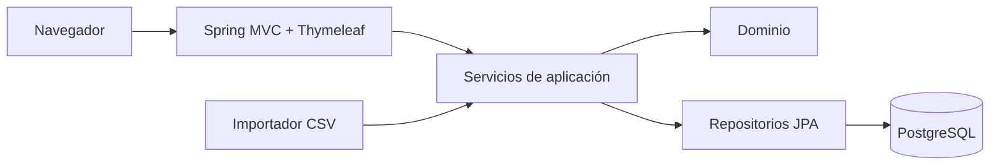

# Arquitectura

## Enfoque

ScoutMatch comienza como un monolito modular. Esta decisión mantiene el despliegue simple y permite separar responsabilidades mediante paquetes y contratos internos.

## Dependencias permitidas

- `web` puede depender de servicios de aplicación y DTOs.
- Los servicios de aplicación coordinan casos de uso y transacciones.
- `domain` contiene reglas y no depende de la web.
- La infraestructura implementa persistencia e integraciones.
- Ninguna vista debe calcular compatibilidad.

## Módulos previstos

| Módulo | Responsabilidad |
|---|---|
| Seguridad | Autenticación y autorización |
| Usuarios | Cuentas y roles |
| Jugadores | Identidad y posiciones |
| Evaluaciones | Informes, versiones y puntajes |
| Necesidades | Necesidades, versiones y criterios |
| Búsquedas | Perfil agregado, estrategia y ejecuciones |
| Seguimiento | Candidatos, estados e historial |
| Importaciones | Vista previa, validación y confirmación de CSV |

## Persistencia

Flyway es la única fuente de verdad para el esquema. Hibernate se configura con `ddl-auto: validate` para detectar diferencias sin modificar la base automáticamente.

## Seguridad del MVP

La configuración inicial contiene usuarios en memoria para permitir una demostración inmediata. El registro libre previsto por el SPEC debe implementarse después sobre `user_account`. La elección libre de rol es una limitación consciente del MVP local y no debe trasladarse a producción.

## Compatibilidad

`CompatibilityStrategy` define el punto de extensión. `WeightedCompatibilityStrategy` implementa la fórmula acordada. Una estrategia futura podrá cambiar el cálculo sin acoplarlo a controladores o entidades de persistencia.

